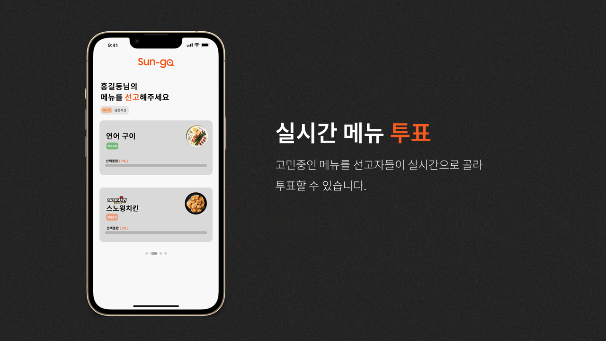
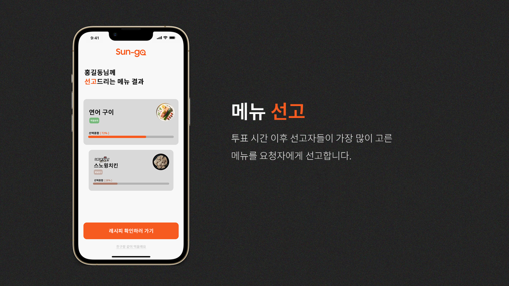
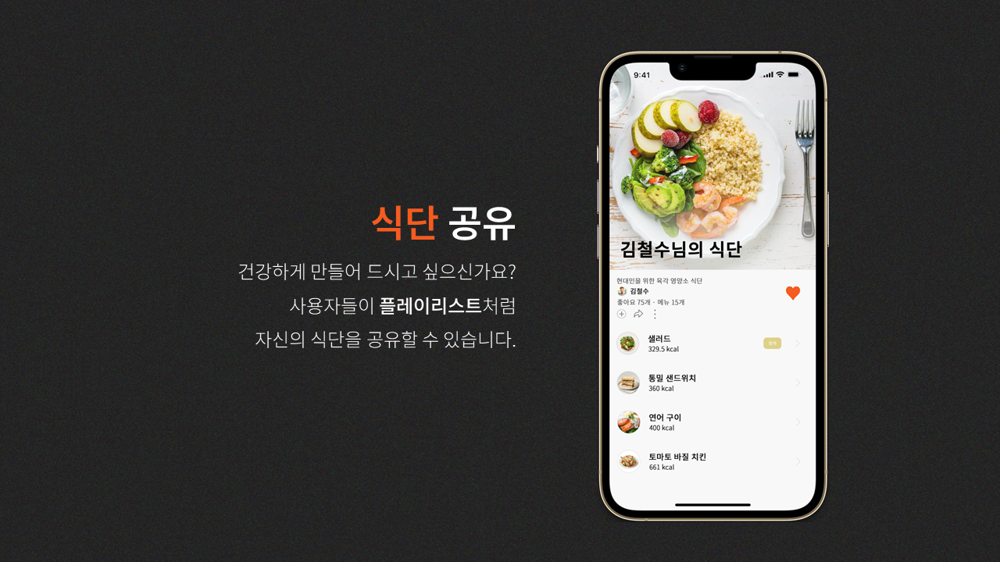
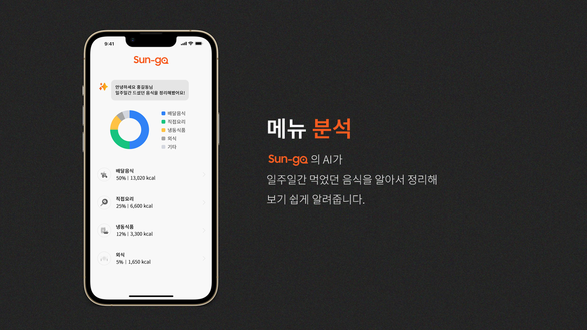
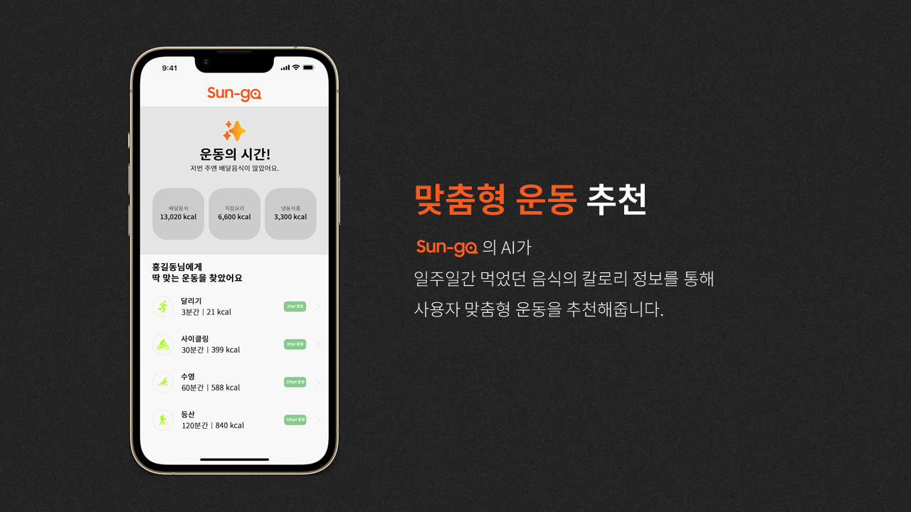

<h1 align="center">당신의 메뉴 선고자</h1> 

  

  <i>멋쟁이사자처럼 대학 12기 아이디어톤 출품작</i> 
  Sun-go (선고) 는 <b>"점메추, 저메추"</b>를 외치는 현대인들에게 메뉴를 실시간으로 선고해주는 플랫폼 입니다. 
  또한 사용자들이 식단을 공유해 개인의 건강을 너머 사회의 건강을 가꿔나가는 것을 목표로 하고 있습니다.

# Features

  
  
  
  
  
  

# ❗안내
이 레포지토리는 프로토타입만 제공합니다.  
실제로 서비스되는 플랫폼이 아닙니다.  
`Copyright ⓒ 2024. Dongmin Lee. All rights reserved.`